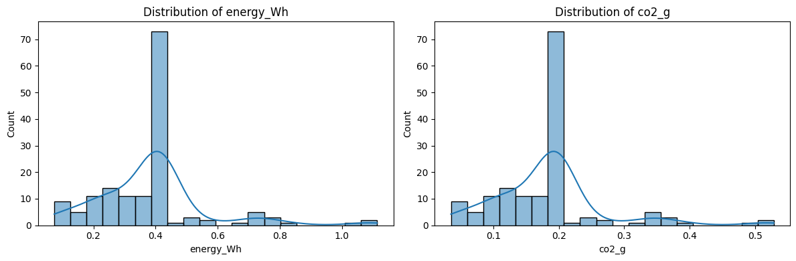
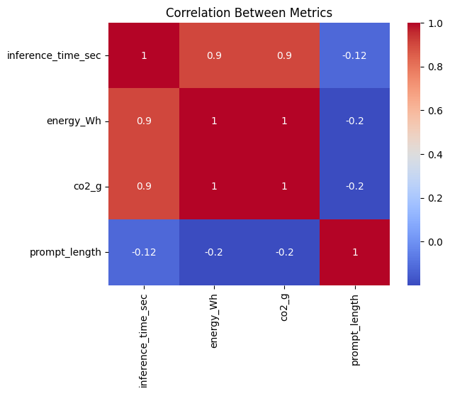
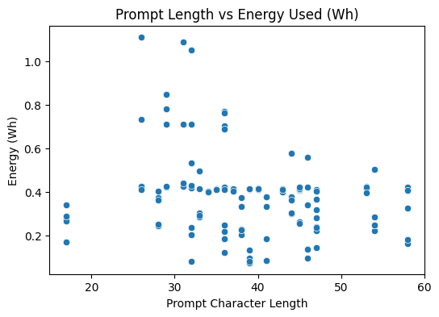
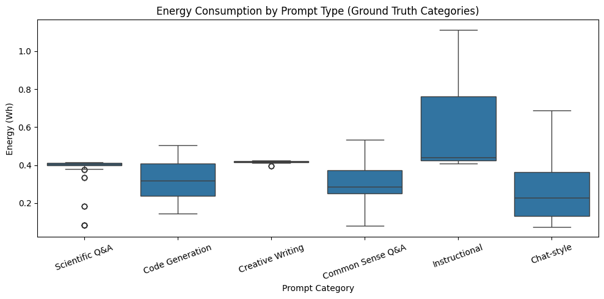
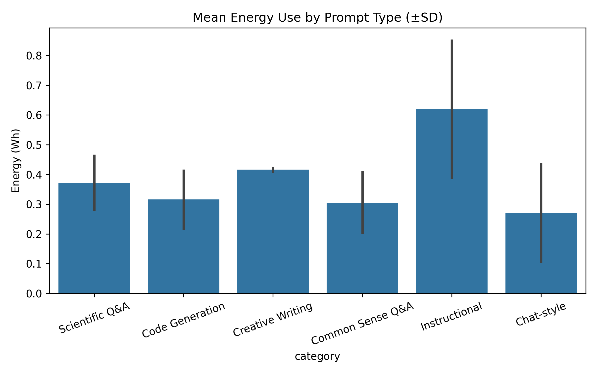
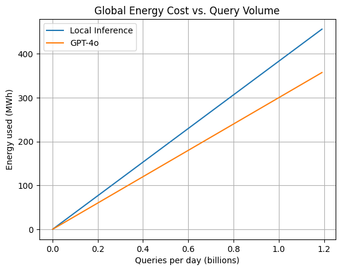

# 🧾 CarbonSwipe: Measuring the Hidden Cost of AI Queries

**CarbonSwipe** is a lightweight, reproducible pipeline to measure the **energy**, **carbon**, and **water footprint** of large language model (LLM) inference on consumer hardware. It benchmarks the environmental impact of running quantized models locally—prompt-by-prompt—using tools like `codecarbon` and `llama-cpp-python`.

---

## 📌 Overview

Large Language Models (LLMs) like GPT-4o consume significant energy during inference. While much focus is placed on training emissions, billions of daily user queries shift the environmental burden to inference. This project addresses that gap by:

- Running **Mistral-7B** locally (4-bit quantized)
- Tracking per-query energy, CO₂, and water cost
- Categorizing 150 diverse prompts (chat, code, Q&A, etc.)
- Comparing local inference to GPT-4o
- Proposing an **AI Carbon Receipt** for transparency

📝 Full paper: [`Research_Intersect.docx`](./Research_Intersect.docx)

---

## 📂 Project Structure

```
CarbonSwipe/
├── code.ipynb                  # Main benchmarking and visualization pipeline
├── Benchmark_Prompts.csv       # 150 prompts for testing
├── benchmark_results.csv       # Outputs: energy, CO₂, latency, length
├── result1.png ... result6.png # Final plots (referenced in paper)
├── Research_Intersect.docx     # Academic-style paper writeup
└── README.md                   # You're reading it!
```

---

## 🚀 Setup & Run

### 1. Install dependencies

```bash
pip install llama-cpp-python codecarbon pandas matplotlib
```

### 2. Download the quantized Mistral-7B model

```bash
mkdir -p /root/models/mistral
wget -O /root/models/mistral/mistral-7b-instruct-v0.1.Q4_K_M.gguf \
  https://huggingface.co/TheBloke/Mistral-7B-Instruct-v0.1-GGUF/resolve/main/mistral-7b-instruct-v0.1.Q4_K_M.gguf
```

### 3. Run the benchmark notebook

Use `code.ipynb` to:
- Load and run the model on 150 prompts
- Track emissions via CodeCarbon
- Output results to CSV
- Generate plots automatically

---

## 📊 Sample Outputs

### 📈 Distributions



### 🔁 Correlations



### 📉 Prompt Length vs Energy



### 📦 Boxplot by Prompt Category



### 📊 Mean Energy by Category



### 🌍 Global Scaling Estimate



---

## 📉 Key Results (150 prompts)

| Metric                   | Mean ± SD          |
|--------------------------|--------------------|
| Energy per query (Wh)    | 0.383 ± 0.176      |
| CO₂ per query (g)        | 0.182 ± 0.084      |
| Water per query (mL)     | 0.689 ± 0.317      |
| Energy per token (J)     | ~3.6               |
| Peak query usage         | >1.1 Wh            |

---

## 💡 Proposed: AI Carbon Receipt

```
🧾 AI Carbon Receipt
Energy: 0.383 Wh  |  CO₂: 0.182 g  |  Water: 0.689 mL
```

A simple, readable format to expose per-query environmental costs to users.


---

## 📎 Acknowledgements

- Mistral-7B model: [TheBloke](https://huggingface.co/TheBloke)
- Carbon tracking: [CodeCarbon](https://github.com/mlco2/codecarbon)
- Research base: Jegham et al. (2025), de Vries (2023), Luccioni et al. (2023)

---

## 📜 License

MIT License — use freely with attribution.

---

## 📬 Contact

**Author**: Jasraj Budigam  
**Email**: budigamjasraj@gmail.com
